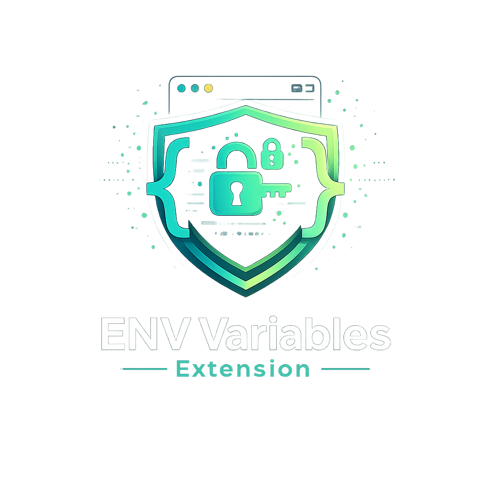
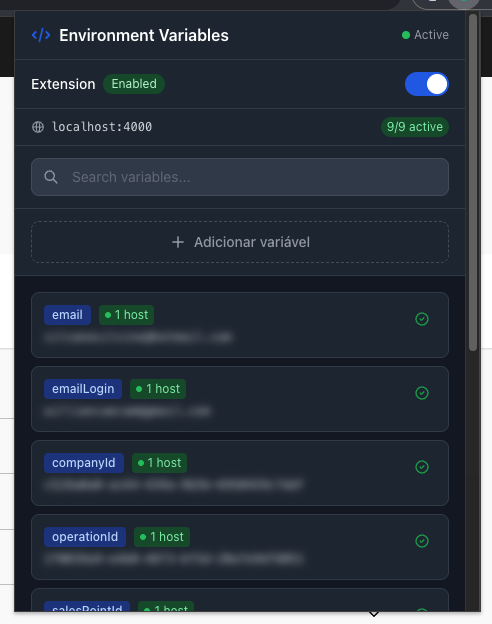
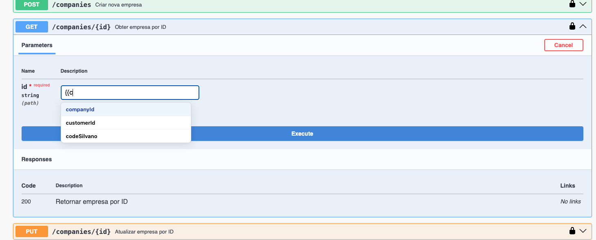
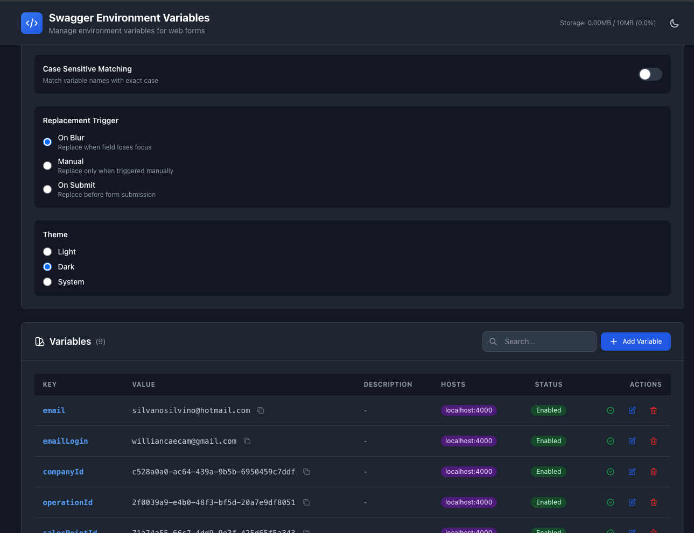

# Swagger Environment Variables

  

  <strong>Streamline your API testing workflow with smart variable management</strong>

  
  
  

  <a href="README.md">🇧🇷 Leia em Português</a>

---

## 🎯 What is this?

A browser extension that automatically replaces `{{variables}}` in web forms with your stored values. Perfect for API testing on Swagger UI, but works anywhere!

Stop copying and pasting auth tokens, API keys, and URLs manually. Just type `{{tokenName}}` and let the extension handle the rest.

## ✨ Key Features

- 🔍 **Auto-Detection**: Finds `{{variable}}` patterns automatically
- ⚡ **Quick Replacement**: Alt+Shift+R to replace all variables instantly
- 💾 **Local Storage**: Everything stays on your machine
- 🎨 **Smart Autocomplete**: Type `{{` to see your variables
- 🌐 **Multi-Host**: Organize variables by API endpoint
- 📤 **Import/Export**: Backup and share configurations

## 📸 Screenshots

### Quick Access Popup

### Usage Example

### Admin Panel

## 📦 Installation

### Chrome/Edge

1. Download or clone this repository
2. Run `npm install && npm run build`
3. Open `chrome://extensions/`
4. Enable "Developer mode"
5. Click "Load unpacked" and select the `dist/` folder

### Firefox

1. Download or clone this repository
2. Run `npm install && npm run build`
3. Open `about:debugging#/runtime/this-firefox`
4. Click "Load Temporary Add-on"
5. Select `manifest.json` from the `dist/` folder

> 📚 **Detailed instructions**: See [Installation Guide](docs/ARCHITECTURE.md#installation)

## 🚀 Quick Start

### 1. Add a Variable

- Click the extension icon or press `Alt+Shift+E`
- Click "Add Variable"
- Enter a name (e.g., `authToken`) and value (e.g., `Bearer xyz...`)
- Save

### 2. Use Variables

Type `{{authToken}}` in any input field and it will be replaced automatically!

### Keyboard Shortcuts

| Shortcut      | Action                |
| ------------- | --------------------- |
| `Alt+Shift+E` | Open popup            |
| `Alt+Shift+R` | Replace all variables |
| `Alt+Shift+T` | Toggle extension      |

### Autocomplete

1. Type `{{` in any field
2. See your variables in a dropdown
3. Use arrow keys to select
4. Press Enter to insert

## 📚 Documentation

- 📖 [Contributing Guide](docs/CONTRIBUTING.md)
- 🏗️ [Architecture & Development](docs/ARCHITECTURE.md)
- 🔒 [Security Policy](docs/SECURITY.md)
- 🗺️ [Roadmap](docs/ROADMAP.md)

## 🤝 Contributing

Contributions are welcome! Check our [Contributing Guide](docs/CONTRIBUTING.md) to get started.

Quick links:

- 🐛 [Report a Bug](https://github.com/williancae/swagger-env-vars/issues/new?template=bug_report.md)
- 💡 [Suggest a Feature](https://github.com/williancae/swagger-env-vars/issues/new?template=feature_request.md)
- 💬 [Discussions](https://github.com/williancae/swagger-env-vars/discussions)

## ⚠️ Security Notice

Variables are stored **unencrypted** in local storage. Suitable for dev/test environments, but avoid storing highly sensitive production credentials.

Version 2.0 will include master password encryption. See [Security Policy](docs/SECURITY.md) for details.

## 📄 License

MIT License - see [LICENSE](LICENSE) file for details.

## ☕ Buy Me a Coffee

If this extension helped you, consider supporting its development!

**PIX (Brazil)**: `williancaecam@gmail.com`

Your support helps keep this project active and free for everyone. Thank you! 🙏

## 📞 Support

- 🐛 **Issues**: [GitHub Issues](https://github.com/williancae/swagger-env-vars/issues)
- 💬 **Discussions**: [GitHub Discussions](https://github.com/williancae/swagger-env-vars/discussions)
- 📧 **Email**: <williancaecam@gmail.com>

---

  Made with ❤️ by developers, for developers

