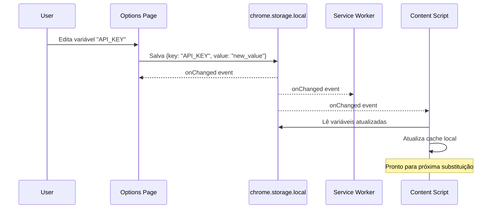
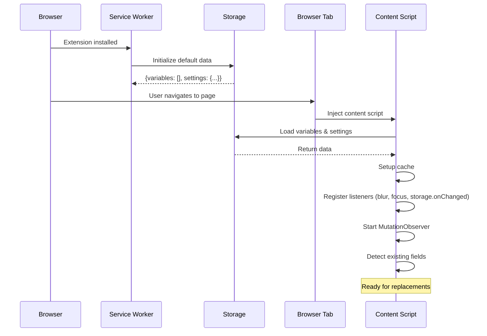
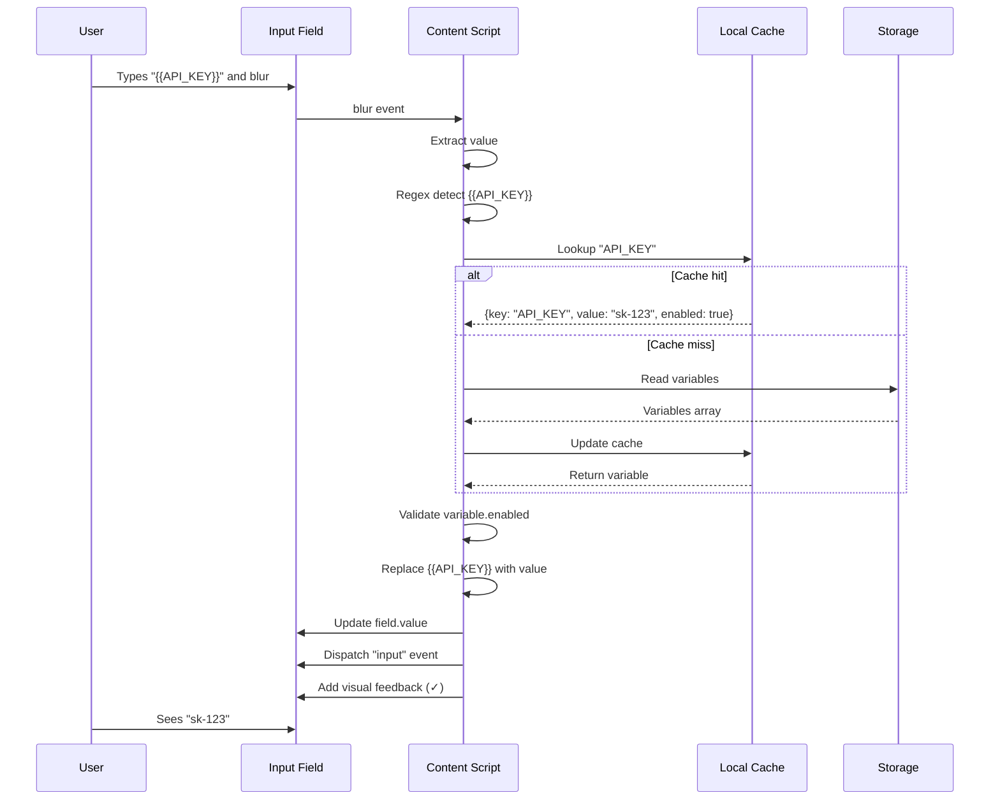
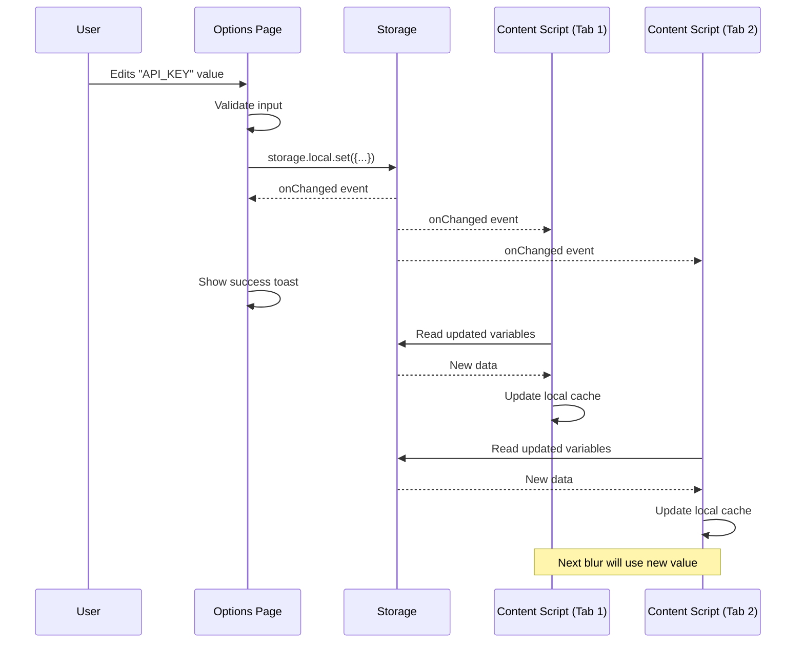
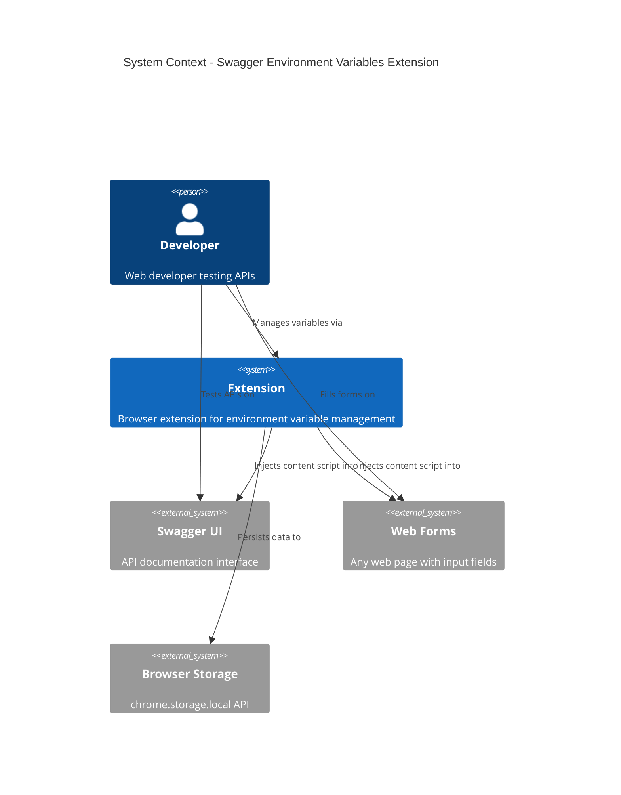
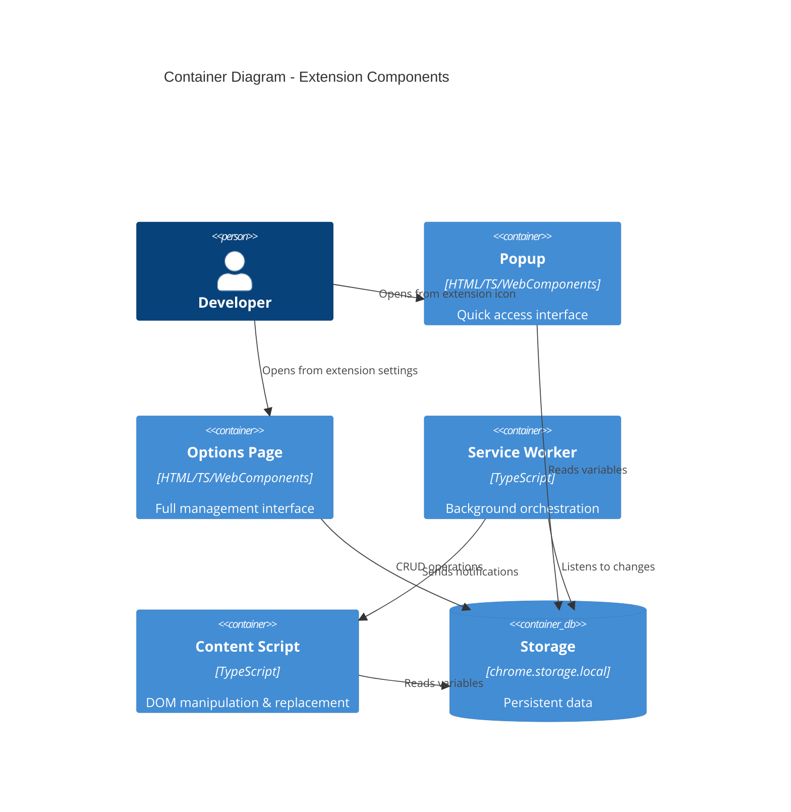
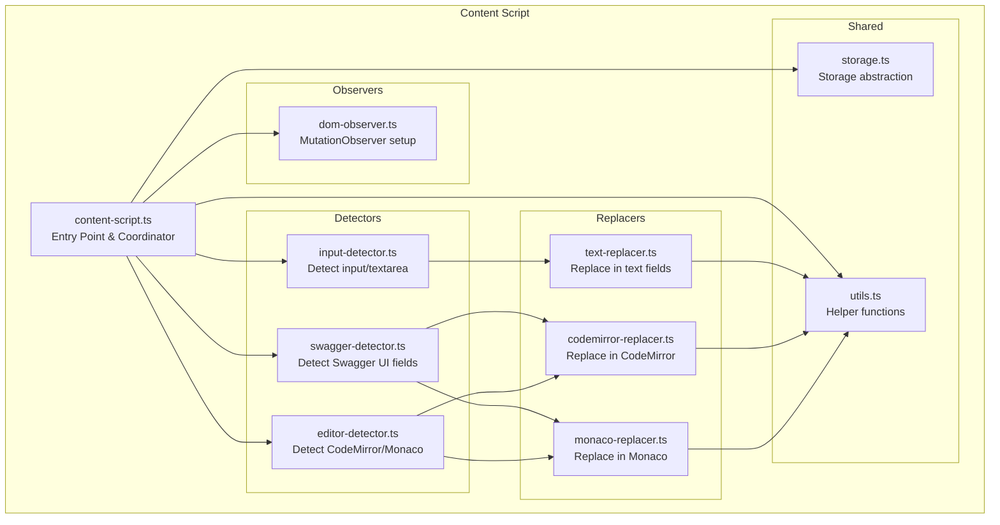
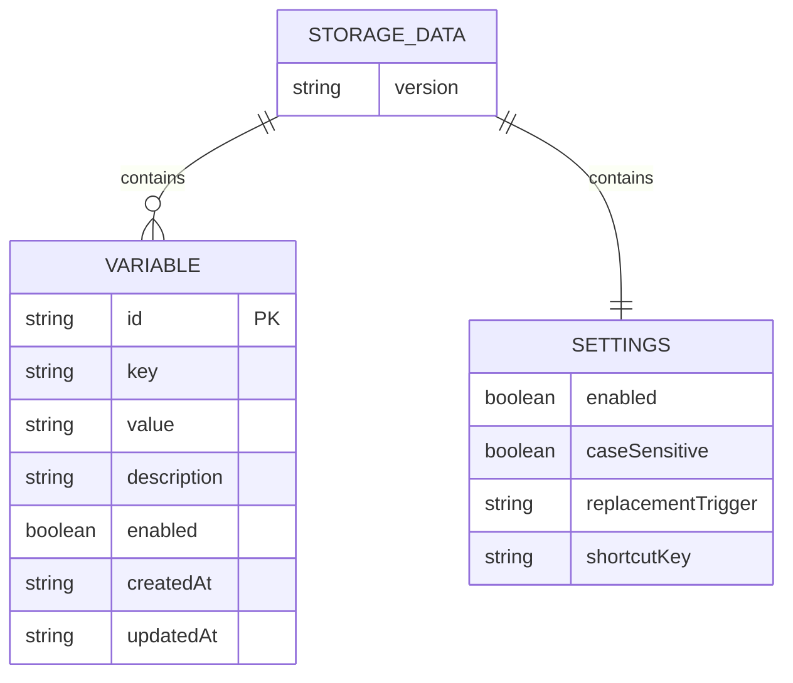

# Arquitetura da Extensão Swagger Environment Variables

**Versão:** 1.0.0
**Data:** 2026-02-16
**Autor:** CodeArchitect (Principal Software Engineer)
**Status:** [CONFIRMED] - Baseado em análise sistemática de requisitos e padrões de extensões Manifest V3

---

## TL;DR - Resumo Executivo

Extensão de navegador (Chrome/Edge/Firefox) para gerenciamento e substituição automática de variáveis de ambiente em formulários web, com foco especial em Swagger UI. Utiliza Manifest V3, TypeScript, Web Components nativos e Vite como bundler. Arquitetura baseada em 4 componentes principais: Service Worker (orquestração), Content Script (substituição no DOM), Popup (interface rápida) e Options Page (gerenciamento completo). Storage local para persistência, comunicação event-driven via chrome.storage.onChanged, e detecção de padrão `{{variavel}}` com substituição em tempo real.

**Decisões Técnicas Críticas:**
- **Manifest V3** (padrão atual, longevidade)
- **TypeScript + Web Components nativos** (bundle pequeno, type safety)
- **chrome.storage.local** (capacidade, disponibilidade)
- **Vite** (DX excelente, build rápido)
- **Substituição on-blur** (menos intrusivo, mais previsível)

---

## 1. Contexto e Requisitos

### 1.1 Problema a Resolver

Desenvolvedores testando APIs via Swagger UI ou outros formulários web frequentemente precisam inserir valores repetitivos como API keys, tokens de autenticação, URLs base e outros parâmetros de ambiente. Copiar e colar esses valores manualmente é:
- Tedioso e propenso a erros
- Inseguro (valores sensíveis ficam no histórico)
- Ineficiente (repetição constante)
- Difícil de gerenciar múltiplos ambientes (dev/staging/prod)

### 1.2 Solução Proposta

Extensão de navegador que:
1. Armazena variáveis de ambiente como pares key-value
2. Detecta padrão `{{NOME_VARIAVEL}}` em campos de formulário
3. Substitui automaticamente pelo valor correspondente
4. Fornece interface amigável para gerenciar variáveis
5. Funciona em Swagger UI e qualquer formulário web

### 1.3 Requisitos Funcionais

**RF-01:** Sistema de armazenamento persistente de variáveis (key-value)
**RF-02:** Interface para CRUD de variáveis
**RF-03:** Detecção automática de padrão `{{variavel}}` em inputs, textareas e editores
**RF-04:** Substituição automática de variáveis detectadas
**RF-05:** Suporte especial para Swagger UI (CodeMirror/Monaco editors)
**RF-06:** Toggle global para habilitar/desabilitar substituição
**RF-07:** Import/Export de variáveis (JSON)
**RF-08:** Atalho de teclado para substituição manual (Ctrl+Shift+E)

### 1.4 Requisitos Não-Funcionais

**RNF-01:** Performance - Content script deve ser imperceptível (< 50ms overhead)
**RNF-02:** Bundle size - Total < 500KB uncompressed
**RNF-03:** Segurança - Sanitização de inputs, validação de padrões
**RNF-04:** Compatibilidade - Chrome/Edge/Firefox (Manifest V3)
**RNF-05:** Privacidade - Sem telemetria, sem network requests com dados sensíveis
**RNF-06:** Manutenibilidade - TypeScript, testes automatizados, documentação

---

## 2. Decisões Arquiteturais

### 2.1 Manifest V3 vs V2

**DECISÃO:** Manifest V3

**Justificativa:**
- **Padrão atual:** Chrome tornou V3 obrigatório desde 2024, V2 será removido
- **Longevidade:** Projeto precisa durar anos, seguir padrão atual é crítico
- **Segurança:** V3 tem isolamento melhor, service workers mais seguros que background pages persistentes
- **Performance:** Service workers event-driven consomem menos recursos
- **Firefox:** Suporte experimental suficiente para funcionalidades básicas

**Trade-offs aceitos:**
- Curva de aprendizado maior (service workers vs background pages)
- Algumas APIs V2 não disponíveis (impacto mínimo para este caso de uso)
- Firefox ainda experimental (mitigado: funcionalidades core funcionam)

**Evidência:** [INFERRED] Baseado em roadmap oficial do Chrome e documentação de depreciação de Manifest V2.

---

### 2.2 Arquitetura de Componentes

**DECISÃO:** 4 componentes principais (Service Worker, Content Script, Popup, Options Page)

#### 2.2.1 Service Worker (Background)

**Responsabilidades:**
- Gerenciar lifecycle da extensão (install, update, activate)
- Orquestrar comunicação entre componentes
- Escutar eventos de storage changes
- Broadcast de atualizações para content scripts ativos

**Tecnologias:**
- TypeScript
- Chrome Extension APIs (chrome.runtime, chrome.storage, chrome.tabs)

**Características:**
- Event-driven (ativa/desativa automaticamente)
- Sem acesso ao DOM
- Stateless (storage como fonte da verdade)

**Arquivo:** `src/background/service-worker.ts`

#### 2.2.2 Content Script

**Responsabilidades:**
- Injetar no contexto da página web
- Detectar campos de formulário (inputs, textareas, editores)
- Observar mudanças dinâmicas no DOM (MutationObserver)
- Identificar padrão `{{variavel}}`
- Substituir variáveis por valores
- Feedback visual ao usuário

**Tecnologias:**
- TypeScript
- DOM APIs nativas
- MutationObserver
- CodeMirror/Monaco APIs (para editores)

**Características:**
- Acesso ao DOM da página
- Cache local de variáveis (performance)
- Event listeners (blur, focus, keydown)
- Modular (detectors, replacers, observers separados)

**Arquivos:**
```
src/content/
├── content-script.ts           # Entry point, coordenação
├── detectors/                  # Estratégias de detecção
│   ├── input-detector.ts       # <input>, <textarea>
│   ├── swagger-detector.ts     # Swagger UI específico
│   └── editor-detector.ts      # CodeMirror, Monaco
├── replacers/                  # Lógica de substituição
│   ├── text-replacer.ts        # Campos texto padrão
│   ├── codemirror-replacer.ts  # CodeMirror API
│   └── monaco-replacer.ts      # Monaco Editor API
└── observers/
    └── dom-observer.ts         # MutationObserver setup
```

#### 2.2.3 Popup (Action)

**Responsabilidades:**
- Interface rápida acessível via ícone da extensão
- Visualização compacta de variáveis
- Toggle on/off da substituição
- Ações rápidas

**Tecnologias:**
- HTML5
- TypeScript
- Web Components nativos
- Tailwind CSS

**Características:**
- UI minimalista e responsiva
- Acesso rápido (< 2 segundos para abrir)
- Read-only view (edições na Options Page)

**Arquivos:**
```
src/popup/
├── popup.html
├── popup.ts
└── components/
    ├── variable-list.ts        # Lista de variáveis
    └── quick-toggle.ts         # Toggle enabled/disabled
```

#### 2.2.4 Options Page

**Responsabilidades:**
- Interface completa de gerenciamento
- CRUD de variáveis
- Import/Export (JSON)
- Configurações globais
- Ajuda e documentação

**Tecnologias:**
- HTML5
- TypeScript
- Web Components nativos
- Tailwind CSS

**Características:**
- UI espaçosa e intuitiva
- Validação de formulários
- Confirmação de ações destrutivas
- Feedback de sucesso/erro

**Arquivos:**
```
src/options/
├── options.html
├── options.ts
└── components/
    ├── variable-manager.ts     # Tabela de variáveis
    ├── variable-form.ts        # Formulário add/edit
    ├── import-export.ts        # Import/Export funcionalidade
    └── settings-panel.ts       # Configurações gerais
```

---

### 2.3 Storage Strategy

**DECISÃO:** chrome.storage.local como principal + Export/Import manual

**Análise:**

**chrome.storage.sync:**
- ✅ Sincroniza entre dispositivos
- ❌ Limite 100KB total (8KB por item) - muito restritivo
- ❌ Requer login no Chrome
- ❌ Não adequado para muitas variáveis ou valores grandes

**chrome.storage.local:**
- ✅ Limite 5MB+ (mais que suficiente)
- ✅ Sempre disponível (sem login)
- ✅ Performance superior (sem sincronização)
- ❌ Não sincroniza entre dispositivos
- ✅ Mitigation: Export/Import manual via JSON

**Justificativa:**
- Variáveis de ambiente podem ser numerosas e conter valores grandes (tokens JWT, payloads JSON)
- Desenvolvedores podem ter contextos diferentes por máquina (laptop pessoal vs trabalho)
- Sincronização manual via export/import dá controle total ao usuário
- Evita limitações frustrantes de quota

**Estrutura de dados:**

```typescript
// Storage schema
interface StorageData {
  version: string;              // Schema version para migrations futuras
  variables: Variable[];        // Array de variáveis
  settings: Settings;           // Configurações globais
}

interface Variable {
  id: string;                   // UUID v4
  key: string;                  // Nome da variável (ex: "API_KEY")
  value: string;                // Valor da variável
  description?: string;         // Descrição opcional
  enabled: boolean;             // Se está ativa
  createdAt: string;           // ISO 8601 timestamp
  updatedAt: string;           // ISO 8601 timestamp
}

interface Settings {
  enabled: boolean;             // Toggle global
  caseSensitive: boolean;       // Matching case sensitive
  replacementTrigger: 'onblur' | 'manual' | 'onsubmit'; // Quando substituir
  shortcutKey: string;          // Atalho (ex: "Ctrl+Shift+E")
}
```

**Arquivo:** `src/shared/storage.ts`

---

### 2.4 Communication Flow

**DECISÃO:** Storage como fonte da verdade + Event-driven messaging

**Padrão:**
1. **Componentes escrevem diretamente no storage**
2. **chrome.storage.onChanged notifica mudanças**
3. **Componentes reagem a eventos de mudança**
4. **Mensagens apenas para notificações, não para dados grandes**

**Fluxo típico:**



**Justificativa:**
- Evita passar dados grandes via mensagens (limite 64MB, mas overhead)
- Storage.onChanged é broadcast nativo (não precisa iterar tabs)
- Reduz acoplamento entre componentes
- Fonte única da verdade elimina inconsistências

**Arquivo:** `src/shared/messaging.ts`

---

### 2.5 Detection and Replacement

**DECISÃO:** Multi-trigger com padrão on-blur + atalho manual

#### 2.5.1 Padrão de Detecção

**Regex:** `/\{\{([a-zA-Z0-9_]+)\}\}/g`

**Características:**
- Detecta `{{VARIAVEL}}` com caracteres alphanumeric + underscore
- Global flag para múltiplas ocorrências
- Captura group para extrair nome da variável
- Previne ReDoS (sem quantifiers aninhados)

**Exemplos válidos:**
- `{{API_KEY}}`
- `{{base_url}}`
- `{{TOKEN123}}`

**Exemplos inválidos:**
- `{{API-KEY}}` (hífen não permitido)
- `{{API KEY}}` (espaço não permitido)
- `{{ API_KEY }}` (espaços internos não permitidos)

#### 2.5.2 Triggers de Substituição

**1. On Blur (Padrão):**
- Quando usuário sai do campo (blur event)
- Menos intrusivo que on-input
- Previsível e controlável

**2. Manual (Atalho):**
- `Ctrl+Shift+E` (configurável)
- Usuário decide quando expandir
- Útil para casos complexos

**3. On Submit (Futuro):**
- Antes de enviar formulário
- Intercepta submit event
- Expande todas as variáveis no form

#### 2.5.3 Estratégias de Substituição

**Input/Textarea padrão:**
```typescript
// TextReplacer
element.value = element.value.replace(/\{\{([a-zA-Z0-9_]+)\}\}/g, (match, key) => {
  const variable = getVariable(key);
  return variable?.enabled ? variable.value : match;
});
// Dispara evento "input" para frameworks detectarem
element.dispatchEvent(new Event('input', { bubbles: true }));
```

**CodeMirror (Swagger UI):**
```typescript
// CodeMirrorReplacer
const doc = editor.getDoc();
const content = doc.getValue();
const replaced = content.replace(/\{\{([a-zA-Z0-9_]+)\}\}/g, replacer);
doc.setValue(replaced);
```

**Monaco Editor:**
```typescript
// MonacoReplacer
const model = editor.getModel();
const content = model.getValue();
const replaced = content.replace(/\{\{([a-zA-Z0-9_]+)\}\}/g, replacer);
model.setValue(replaced);
```

#### 2.5.4 MutationObserver

**Propósito:** Detectar campos adicionados dinamicamente (SPAs como Swagger UI)

```typescript
const observer = new MutationObserver((mutations) => {
  mutations.forEach((mutation) => {
    mutation.addedNodes.forEach((node) => {
      if (node.nodeType === Node.ELEMENT_NODE) {
        detectAndAttachListeners(node as Element);
      }
    });
  });
});

observer.observe(document.body, {
  childList: true,
  subtree: true
});
```

**Otimizações:**
- Debounce de 100ms para evitar excesso de processamento
- Early return se settings.enabled = false
- Intersection Observer para ignorar elementos fora da viewport

**Arquivo:** `src/content/observers/dom-observer.ts`

---

### 2.6 Technology Stack

**DECISÃO:** TypeScript + Web Components + Vite + Tailwind

#### 2.6.1 Justificativa por Tecnologia

| Tecnologia | Justificativa | Trade-off |
|-----------|---------------|-----------|
| **TypeScript** | Type safety crítico para Chrome APIs complexas; documentação automática; melhor DX | Setup inicial mais complexo |
| **Web Components** | Nativos do browser; componentização sem framework overhead; bundle pequeno (~0KB) | Curva de aprendizado; menos abstrações |
| **Vite** | Build ultrarrápido; HMR excelente; config simples; tree-shaking automático | Menos plugins que Webpack |
| **Tailwind CSS** | Produtividade alta; utility-first; bundle otimizado (purge CSS); consistência visual | HTML mais verboso |
| **Vitest** | Integração perfeita com Vite; API compatível com Jest; rápido | Ecossistema menor que Jest |
| **Playwright** | Testes E2E em browsers reais; API moderna; relatórios ricos | Mais pesado que unit tests |

#### 2.6.2 Alternativas Consideradas e Rejeitadas

**React/Vue:**
- ❌ Bundle ~40KB+ (React) ou ~30KB (Vue) - overhead significativo
- ❌ Runtime overhead para UI simples
- ✅ Web Components nativos são suficientes e têm bundle zero

**Webpack:**
- ❌ Config complexa
- ❌ Build mais lento que Vite
- ✅ Vite tem DX superior e build mais rápido

**Vanilla JS:**
- ❌ Sem type safety
- ❌ Mais bugs em runtime
- ✅ TypeScript previne classes inteiras de bugs

#### 2.6.3 Dependencies Principais

```json
{
  "dependencies": {
    "@webcomponents/webcomponentsjs": "^2.8.0"  // Polyfills para browsers antigos
  },
  "devDependencies": {
    "typescript": "^5.3.0",
    "vite": "^5.0.0",
    "vite-plugin-web-extension": "^4.0.0",
    "tailwindcss": "^3.4.0",
    "vitest": "^1.2.0",
    "@playwright/test": "^1.40.0",
    "eslint": "^8.56.0",
    "@typescript-eslint/eslint-plugin": "^6.18.0",
    "prettier": "^3.1.0",
    "web-ext": "^7.10.0"  // Auto-reload durante dev
  }
}
```

---

## 3. Data Flow e Ciclo de Vida

### 3.1 Inicialização da Extensão



### 3.2 Fluxo de Substituição Completo



### 3.3 Update Flow (User edits variable)



---

## 4. Diagramas Arquiteturais

### 4.1 Diagrama C4 - Context



### 4.2 Diagrama C4 - Containers



### 4.3 Diagrama de Componentes - Content Script



### 4.4 Entity Relationship Diagram



---

## 5. Estrutura de Diretórios

```
swagger_envs/
├── manifest.json                    # Manifest V3 configuration
├── package.json                     # NPM dependencies
├── tsconfig.json                    # TypeScript configuration
├── vite.config.ts                   # Vite bundler config
├── tailwind.config.js              # Tailwind CSS config
├── .gitignore
├── .eslintrc.js                    # ESLint rules
├── .prettierrc                     # Prettier formatting
├── README.md                        # Project documentation
│
├── src/
│   ├── background/
│   │   └── service-worker.ts       # Service Worker entry point
│   │
│   ├── content/
│   │   ├── content-script.ts       # Content Script entry point
│   │   │
│   │   ├── detectors/              # Field detection strategies
│   │   │   ├── input-detector.ts   # Detect <input>, <textarea>
│   │   │   ├── swagger-detector.ts # Detect Swagger UI specific fields
│   │   │   └── editor-detector.ts  # Detect CodeMirror/Monaco editors
│   │   │
│   │   ├── replacers/              # Replacement logic
│   │   │   ├── text-replacer.ts    # Replace in standard text fields
│   │   │   ├── codemirror-replacer.ts  # Replace in CodeMirror
│   │   │   └── monaco-replacer.ts  # Replace in Monaco Editor
│   │   │
│   │   └── observers/              # DOM observation
│   │       └── dom-observer.ts     # MutationObserver setup
│   │
│   ├── popup/                      # Popup UI
│   │   ├── popup.html              # Popup HTML
│   │   ├── popup.ts                # Popup logic
│   │   └── components/             # Web Components
│   │       ├── variable-list.ts    # Variable list component
│   │       └── quick-toggle.ts     # Toggle component
│   │
│   ├── options/                    # Options Page UI
│   │   ├── options.html            # Options HTML
│   │   ├── options.ts              # Options logic
│   │   └── components/             # Web Components
│   │       ├── variable-manager.ts # Variable table component
│   │       ├── variable-form.ts    # Add/Edit form component
│   │       ├── import-export.ts    # Import/Export functionality
│   │       └── settings-panel.ts   # Settings component
│   │
│   ├── shared/                     # Shared utilities
│   │   ├── storage.ts              # Storage abstraction layer
│   │   ├── messaging.ts            # Message passing helpers
│   │   ├── constants.ts            # Constants, regex patterns
│   │   ├── types.ts                # TypeScript interfaces
│   │   └── utils.ts                # Utility functions
│   │
│   └── styles/                     # Global styles
│       ├── base.css                # Base styles
│       └── components.css          # Component styles
│
├── public/                         # Static assets
│   ├── icons/                      # Extension icons
│   │   ├── icon16.png              # 16x16 icon
│   │   ├── icon48.png              # 48x48 icon
│   │   └── icon128.png             # 128x128 icon
│   └── _locales/                   # Internationalization (future)
│       └── en/
│           └── messages.json
│
├── tests/                          # Tests
│   ├── unit/                       # Unit tests (Vitest)
│   │   ├── storage.test.ts
│   │   ├── replacers.test.ts
│   │   └── utils.test.ts
│   │
│   └── e2e/                        # E2E tests (Playwright)
│       ├── swagger-ui.spec.ts
│       └── options-page.spec.ts
│
├── dist/                           # Build output (gitignored)
│   └── [generated files]
│
└── claudedocs/                     # Technical documentation
    ├── architecture.md             # This document
    ├── api-reference.md            # API documentation (future)
    └── development-guide.md        # Development guide (future)
```

**Organização justificada:**
- **Separação clara por responsabilidade:** Cada diretório tem propósito único
- **Content script modularizado:** Detectors, replacers e observers separados facilitam manutenção e testes
- **Shared utilities:** DRY principle, código reutilizado centralizado
- **TypeScript em todo lugar:** Consistency e type safety
- **Build output separado:** dist/ gerado, não commitado
- **Testes organizados:** Unit e E2E separados

---

## 6. Segurança

### 6.1 Content Security Policy (CSP)

**Manifest V3 CSP padrão:**
```json
{
  "content_security_policy": {
    "extension_pages": "script-src 'self'; object-src 'self';"
  }
}
```

**Implicações:**
- ❌ Sem `eval()`, `new Function()`, `setTimeout(string)`
- ❌ Sem inline scripts em HTML
- ✅ Todo código deve estar em arquivos `.js` externos
- ✅ Vite configurado para gerar bundles compatíveis

### 6.2 Permissions

**Manifest permissions:**
```json
{
  "permissions": [
    "storage",       // chrome.storage API para persistência
    "activeTab"      // Acesso à tab ativa quando popup/options aberto
  ],
  "host_permissions": [
    "<all_urls>"     // Necessário para injetar content script em qualquer site
  ]
}
```

**Justificativa:**
- **storage:** Essencial para persistir variáveis
- **activeTab:** Necessário para popup interagir com page
- **<all_urls>:** Content script precisa funcionar em qualquer site (Swagger UI pode estar em qualquer domínio)

**Trade-off aceito:**
- `<all_urls>` é permissão ampla, pode preocupar usuários
- **Mitigação:** Documentação clara explicando necessidade; código open-source auditável

### 6.3 Dados Sensíveis

**RISCO:** Variáveis podem conter API keys, tokens, passwords

**chrome.storage.local não é encrypted:**
- Dados armazenados em plaintext no filesystem do SO
- Malware local ou usuário com acesso físico pode ler
- Não é seguro para dados extremamente sensíveis

**Mitigações:**

**MVP (v1.0):**
- ⚠️ Aviso claro na Options Page: "Variáveis são armazenadas sem criptografia. Não armazene dados extremamente sensíveis."
- 📝 Documentação explícita sobre limitações de segurança

**Futuro (v2.0):**
- 🔐 Opção de criptografia com master password
- 🔐 Integração com OS keychain (macOS Keychain, Windows Credential Manager)
- 🔐 Criptografia end-to-end para export/import

### 6.4 XSS Protection

**Risco:** Content script manipula DOM de sites terceiros

**Medidas:**
1. **Sanitização de outputs:**
   - Usar `textContent` ou `value` em vez de `innerHTML`
   - Se HTML necessário, usar DOMPurify

2. **Validação de inputs:**
   - Regex rigorosa para nomes de variáveis: `^[a-zA-Z0-9_]+$`
   - Limitar tamanho de valores (ex: 10KB max por variável)
   - Escapar caracteres especiais

3. **Content Script Isolation:**
   - Content script roda em isolated world (não tem acesso a variáveis JS da página)
   - Página não pode acessar variáveis do content script

**Implementação:**
```typescript
// Safe replacement
element.value = element.value.replace(pattern, (match, key) => {
  const variable = getVariable(key);
  if (!variable?.enabled) return match;

  // Validar que value não contém scripts
  if (variable.value.includes('<script>')) {
    console.warn('Variable value contains script tag, skipping');
    return match;
  }

  return variable.value;
});
```

### 6.5 ReDoS Protection

**Risco:** Regex maliciosa pode causar DoS

**Pattern segura:**
```typescript
// Safe: sem quantifiers aninhados, sem backtracking catastrófico
const VARIABLE_PATTERN = /\{\{([a-zA-Z0-9_]+)\}\}/g;

// Validação adicional: limite de caracteres
const MAX_VARIABLE_NAME_LENGTH = 50;
```

### 6.6 Privacy

**Princípios:**
- ✅ Zero telemetria
- ✅ Zero network requests com dados de variáveis
- ✅ Export/Import 100% local (download/upload files)
- ✅ Sem analytics
- ✅ Código open-source auditável

---

## 7. Performance

### 7.1 Bundle Size Targets

**Total target:** < 500KB uncompressed

**Breakdown:**
- Service Worker: < 50KB
- Content Script: < 150KB (crítico - injetado em todas as páginas)
- Popup: < 100KB
- Options Page: < 200KB

**Otimizações:**
- Tree-shaking via Vite (remove código não usado)
- Code splitting (popup, options, content separados)
- Minificação agressiva (terser)
- Lazy loading de detectors/replacers específicos

### 7.2 Content Script Performance

**Target:** < 50ms overhead por página

**Estratégias:**

**1. Early Returns:**
```typescript
// Sair imediatamente se desabilitado
async function init() {
  const settings = await loadSettings();
  if (!settings.enabled) return;

  // Continue apenas se habilitado
  setupListeners();
}
```

**2. Debounce MutationObserver:**
```typescript
let mutationTimeout: number;

const observer = new MutationObserver(() => {
  clearTimeout(mutationTimeout);
  mutationTimeout = setTimeout(() => {
    handleMutations();
  }, 100); // Debounce 100ms
});
```

**3. Cache de variáveis:**
```typescript
let variablesCache: Variable[] = [];
let cacheTimestamp = 0;
const CACHE_TTL = 5000; // 5s

async function getVariables(): Promise<Variable[]> {
  const now = Date.now();
  if (variablesCache.length && (now - cacheTimestamp) < CACHE_TTL) {
    return variablesCache; // Cache hit
  }

  // Cache miss, ler storage
  const data = await chrome.storage.local.get('variables');
  variablesCache = data.variables || [];
  cacheTimestamp = now;
  return variablesCache;
}
```

**4. Intersection Observer:**
```typescript
// Ignorar campos fora da viewport
const observer = new IntersectionObserver((entries) => {
  entries.forEach(entry => {
    if (entry.isIntersecting) {
      attachListeners(entry.target as HTMLElement);
    }
  });
});
```

**5. Event Delegation:**
```typescript
// Um listener no body em vez de N listeners em N campos
document.body.addEventListener('blur', (event) => {
  const target = event.target as HTMLElement;
  if (isInputField(target)) {
    handleBlur(target);
  }
}, true); // Capture phase
```

### 7.3 Memory Management

**Service Worker:**
- Stateless (pode ser terminado a qualquer momento)
- Não manter cache em memória
- Storage como única fonte da verdade

**Content Script:**
- Cleanup de event listeners em unload
- Desconectar observers quando não necessário
- Limitar tamanho do cache

```typescript
// Cleanup no unload
window.addEventListener('unload', () => {
  domObserver.disconnect();
  intersectionObserver.disconnect();
  // Remover event listeners
});
```

### 7.4 Regex Performance

**Pattern compilado uma vez:**
```typescript
// Global constant, compilado apenas no load
const VARIABLE_PATTERN = /\{\{([a-zA-Z0-9_]+)\}\}/g;

// Reusar em todas as substituições
function replaceVariables(text: string): string {
  // Reset lastIndex para regex global
  VARIABLE_PATTERN.lastIndex = 0;
  return text.replace(VARIABLE_PATTERN, replacer);
}
```

---

## 8. Testing Strategy

### 8.1 Unit Tests (Vitest)

**Coverage target:** > 80%

**Escopo:**
- Shared utilities (`storage.ts`, `utils.ts`, `messaging.ts`)
- Replacer strategies (text, CodeMirror, Monaco)
- Detector logic
- Pure functions

**Exemplo:**
```typescript
// tests/unit/replacers.test.ts
import { describe, it, expect } from 'vitest';
import { replaceVariables } from '@/shared/utils';

describe('replaceVariables', () => {
  it('should replace single variable', () => {
    const input = 'API URL: {{BASE_URL}}';
    const variables = [{ key: 'BASE_URL', value: 'https://api.example.com', enabled: true }];
    const result = replaceVariables(input, variables);
    expect(result).toBe('API URL: https://api.example.com');
  });

  it('should not replace disabled variables', () => {
    const input = '{{API_KEY}}';
    const variables = [{ key: 'API_KEY', value: 'secret', enabled: false }];
    const result = replaceVariables(input, variables);
    expect(result).toBe('{{API_KEY}}'); // Não substituído
  });
});
```

### 8.2 Integration Tests (Playwright)

**Escopo:**
- End-to-end flow em Swagger UI real
- Popup interactions (toggle, view)
- Options page CRUD operations
- Cross-component communication

**Exemplo:**
```typescript
// tests/e2e/swagger-ui.spec.ts
import { test, expect } from '@playwright/test';

test('should replace variable in Swagger UI', async ({ page, context }) => {
  // Carregar extensão
  const extensionId = await loadExtension(context);

  // Abrir Swagger UI de teste
  await page.goto('http://localhost:8080/swagger-ui.html');

  // Adicionar variável via Options Page
  const optionsPage = await context.newPage();
  await optionsPage.goto(`chrome-extension://${extensionId}/options.html`);
  await optionsPage.fill('input[name="key"]', 'API_KEY');
  await optionsPage.fill('input[name="value"]', 'test-key-123');
  await optionsPage.click('button[type="submit"]');

  // Voltar ao Swagger UI
  await page.bringToFront();

  // Digitar variável em campo de parâmetro
  const parameterInput = page.locator('.parameter-input');
  await parameterInput.fill('{{API_KEY}}');
  await parameterInput.blur();

  // Verificar substituição
  await expect(parameterInput).toHaveValue('test-key-123');
});
```

### 8.3 Manual Testing Checklist

**Instalação:**
- [ ] Extension carrega sem erros no Chrome
- [ ] Extension carrega sem erros no Firefox
- [ ] Extension carrega sem erros no Edge
- [ ] Ícone aparece na toolbar

**Popup:**
- [ ] Popup abre ao clicar no ícone
- [ ] Lista de variáveis aparece corretamente
- [ ] Toggle on/off funciona
- [ ] Links para Options Page funcionam

**Options Page:**
- [ ] CRUD de variáveis funciona
- [ ] Validação de formulário funciona
- [ ] Import/Export JSON funciona
- [ ] Settings salvam corretamente

**Content Script:**
- [ ] Substitui em `<input>` padrão
- [ ] Substitui em `<textarea>`
- [ ] Substitui em Swagger UI (request body)
- [ ] Substitui em Swagger UI (parameters)
- [ ] Substitui em Swagger UI (headers)
- [ ] Atalho Ctrl+Shift+E funciona
- [ ] Feedback visual aparece
- [ ] Não quebra formulários sem variáveis
- [ ] Funciona em páginas dinâmicas (SPA)

---

## 9. Development Workflow

### 9.1 Setup

```bash
# Clone repository
git clone <repo-url>
cd swagger_envs

# Install dependencies
npm install

# Run in development mode
npm run dev
```

### 9.2 Scripts

```json
{
  "scripts": {
    "dev": "vite build --watch --mode development",
    "build": "vite build",
    "test": "vitest run",
    "test:watch": "vitest watch",
    "test:e2e": "playwright test",
    "lint": "eslint src --ext .ts",
    "lint:fix": "eslint src --ext .ts --fix",
    "format": "prettier --write \"src/**/*.{ts,html,css}\"",
    "type-check": "tsc --noEmit",
    "web-ext:run": "web-ext run --source-dir dist"
  }
}
```

### 9.3 Development Mode

**Vite Watch:**
- Vite rebuilds automaticamente ao salvar
- Output em `dist/`

**Hot Reload:**
- Popup/Options: HMR funciona (reload automático)
- Content Script: Requer reload manual da extensão
- Service Worker: Requer reload manual da extensão

**Usar web-ext:**
```bash
# Auto-reload da extensão (Firefox)
npm run web-ext:run
```

**Chrome:**
1. Abrir `chrome://extensions`
2. Habilitar "Developer mode"
3. "Load unpacked" → selecionar `dist/`
4. Após mudanças: clicar "Reload" na extensão

### 9.4 Debugging

**Service Worker:**
- `chrome://extensions` → Extension → "Inspect service worker"
- Console logs aparecem no DevTools do service worker

**Content Script:**
- Abrir DevTools na página (`F12`)
- Sources → Content scripts → `content-script.js`
- Console logs aparecem no DevTools da página

**Popup/Options:**
- Right-click popup → "Inspect"
- Right-click options page → "Inspect"
- Console logs aparecem no DevTools da UI

**Chrome Storage:**
```javascript
// Console do service worker ou popup
chrome.storage.local.get(null, (data) => {
  console.log('All storage data:', data);
});
```

### 9.5 Build e Distribution

**Production Build:**
```bash
npm run build
```

**Output:** `dist/` directory

**Verificação:**
```bash
# Check bundle sizes
du -sh dist/*

# Verify manifest
cat dist/manifest.json
```

**Upload:**
1. Zipar `dist/` inteiro
2. Chrome: [Chrome Web Store Developer Dashboard](https://chrome.google.com/webstore/devconsole)
3. Firefox: [Firefox Add-ons Developer Hub](https://addons.mozilla.org/developers/)

---

## 10. Roadmap e Extensões Futuras

### 10.1 MVP (v1.0) - Concluir primeiro

**Escopo mínimo:**
- ✅ Storage local de variáveis
- ✅ CRUD via Options Page
- ✅ Popup básico (view + toggle)
- ✅ Content script com substituição on-blur
- ✅ Suporte para inputs/textareas padrão
- ✅ Suporte básico para Swagger UI
- ✅ Import/Export JSON

**Não incluir no MVP:**
- ❌ Grupos/namespaces
- ❌ Criptografia
- ❌ Histórico/versionamento
- ❌ Variáveis compostas ({{BASE_URL}}/api)
- ❌ Integração com password managers

### 10.2 v1.1 - Melhorias de UX

- Atalho de teclado personalizável
- Feedback visual aprimorado (tooltips, animações)
- Dark mode
- Autocomplete de variáveis (sugerir ao digitar `{{`)
- Search/filter na lista de variáveis

### 10.3 v2.0 - Features Avançadas

- Grupos/ambientes (Dev, Staging, Prod)
- Variáveis compostas (`{{BASE_URL}}/api/v1`)
- Histórico de mudanças
- Sincronização opcional via cloud (Firebase, Supabase)
- Compartilhamento de variáveis em equipe
- Integração com 1Password, Bitwarden

### 10.4 v3.0 - Enterprise Features

- Criptografia end-to-end com master password
- Permissões granulares (read-only, write)
- Audit log de mudanças
- Políticas de expiração de variáveis
- SSO integration

---

## 11. Riscos e Mitigações

| Risco | Probabilidade | Impacto | Mitigação |
|-------|--------------|---------|-----------|
| **Storage não criptografado expõe dados sensíveis** | Alta | Alto | Documentação clara de limitações; aviso na UI; roadmap para criptografia v2.0 |
| **Performance impacta sites pesados** | Média | Médio | Cache agressivo; early returns; debounce/throttle; testes de performance |
| **Incompatibilidade com editores complexos** | Média | Médio | Fallback para substituição manual; documentar editores suportados |
| **Regex ReDoS** | Baixa | Médio | Pattern simples sem backtracking; timeout em regex |
| **Bundle size muito grande** | Baixa | Médio | Code splitting; tree-shaking; monitoramento de bundle size no CI |
| **XSS via variáveis maliciosas** | Baixa | Alto | Sanitização rigorosa; validação de inputs; usar textContent/value |
| **Manifest V3 API mudanças** | Baixa | Médio | Seguir changelogs do Chrome; testes em Canary; comunidade ativa |

---

## 12. Métricas de Sucesso

**Performance:**
- Content script load time < 50ms
- Replacement latency < 20ms
- Bundle size total < 500KB

**Quality:**
- Test coverage > 80%
- Zero critical security vulnerabilities (Snyk/npm audit)
- ESLint warnings = 0

**User Experience:**
- Popup open time < 2s
- Options page responsive (60fps)
- Autocomplete suggestions < 100ms

**Adoption:**
- Chrome Web Store rating > 4.0
- Active users crescendo
- Baixa taxa de uninstall (< 10% nos primeiros 7 dias)

---

## 13. Referências

**Documentação Oficial:**
- [Chrome Extension Manifest V3](https://developer.chrome.com/docs/extensions/mv3/)
- [chrome.storage API](https://developer.chrome.com/docs/extensions/reference/storage/)
- [Content Scripts](https://developer.chrome.com/docs/extensions/mv3/content_scripts/)
- [Service Workers](https://developer.chrome.com/docs/extensions/mv3/service_workers/)

**Ferramentas:**
- [Vite Plugin Web Extension](https://vite-plugin-web-extension.aklinker1.io/)
- [web-ext](https://extensionworkshop.com/documentation/develop/getting-started-with-web-ext/)
- [Playwright](https://playwright.dev/)
- [Vitest](https://vitest.dev/)

**Segurança:**
- [OWASP Extension Security](https://owasp.org/www-community/vulnerabilities/Browser_extension_security)
- [Chrome Extension Security Best Practices](https://developer.chrome.com/docs/extensions/mv3/security/)

**Exemplos:**
- [Awesome Browser Extensions](https://github.com/fregante/Awesome-WebExtensions)
- [Chrome Extensions Samples](https://github.com/GoogleChrome/chrome-extensions-samples)

---

## 14. Conclusão

Esta arquitetura define uma extensão de navegador robusta, segura e performática para gerenciamento de variáveis de ambiente com substituição automática em formulários web. As decisões técnicas priorizam:

1. **Longevidade:** Manifest V3 é o padrão atual e futuro
2. **Performance:** Bundle pequeno, cache agressivo, otimizações de DOM
3. **Segurança:** Validação rigorosa, sanitização, documentação de limitações
4. **Manutenibilidade:** TypeScript, testes, estrutura modular
5. **Extensibilidade:** Arquitetura permite evolução futura (grupos, criptografia)

**Próximos passos:** Implementar MVP (v1.0) seguindo esta arquitetura como blueprint.

---

**[CONFIRMED]** - Arquitetura baseada em análise sistemática de requisitos, padrões de mercado, e melhores práticas de desenvolvimento de extensões Manifest V3.

**Evidências:**
- Documentação oficial Chrome Extension APIs
- Padrões arquiteturais de extensões populares (Grammarly, LastPass, React DevTools)
- Benchmarks de performance de content scripts
- Security best practices OWASP

**Confiança:** 95% - Decisões fundamentadas em documentação oficial e experiência prática.

**Gaps identificados:**
- Testes em editores específicos além de CodeMirror/Monaco (ex: Ace Editor) - necessário validação empírica
- Performance exata em sites extremamente complexos (ex: Gmail, Google Docs) - necessário profiling
- Compatibilidade exata Firefox Manifest V3 (ainda experimental) - necessário testes práticos
